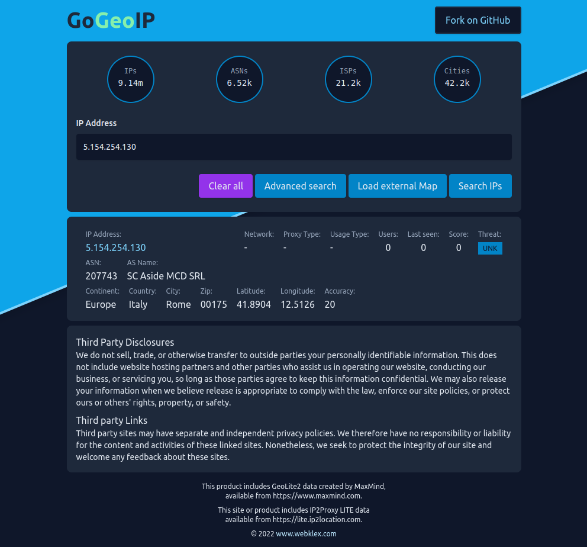

# GoGeoIP Web API

GoGeoIP - a web api providing ip intelligence written in GO. This software provides an api to get as much
information as possible for a given IP address or the current visitor. This includes network, system, location and
user information. It may also be used to search for ip addresses in certain areas, from certain ISPs, etc.
A [Live Demo](https://www.gogeoip.com/) is available under [www.gogeoip.com](https://www.gogeoip.com/).

[![Releases][ico-release]](https://github.com/Webklex/gogeoip/releases)
[![Downloads][ico-downloads]](https://github.com/Webklex/gogeoip/releases)
[![Demo][ico-website-status]](https://www.gogeoip.com/)
[![License][ico-license]](LICENSE.md)
[![Hits][ico-hits]][link-hits]



## Table of Contents

- [Features](#features)
- [Configuration & Setup](#configuration--setup)
- [Database](#databases)
- [Api](#api)
    - [Your IP](#get-your-own-ip-information)
    - [Your Language](#get-your-own-language)
    - [Your User Agent](#get-your-own-user-agent)
    - [Statistic](#get-database-statistic)
    - [Country information](#get-country-information)
    - [IP information](#get-ip-information)
    - [Search IPs](#search-ips)
- [Development](#development)
- [Build](#build)
- [Support](#support)
- [Security](#security)
- [Credits](#credits)
- [License](#license)

### Features

* Serving over HTTPS (TLS) using your own certificates, or provisioned automatically
  using [LetsEncrypt.org](https://letsencrypt.org)
* [HSTS ready](https://en.wikipedia.org/wiki/HTTP_Strict_Transport_Security) to restrict your browser clients to always
  use HTTPS
* Configurable read and write timeouts to avoid stale clients consuming server resources
* Reverse proxy ready
* Configurable [CORS](https://en.wikipedia.org/wiki/Cross-origin_resource_sharing) to restrict access to specific
  domains
* Configurable api prefix to serve the API alongside other APIs on the same host
* Optional round trip optimization by enabling [TCP Fast Open](https://en.wikipedia.org/wiki/TCP_Fast_Open)
* Integrated rate limit (quota) for your clients (per client IP) based on requests per time interval
* Serve the default [GeoLite2 City](https://dev.maxmind.com/geoip/geoip2/geolite2/) free database that is downloaded and
  updated automatically in background on a configurable schedule, or
* Serve the commercial [GeoIP2 City](https://www.maxmind.com/en/geoip2-city) database from MaxMind, either as a local
  file that you provide and update periodically (so the server can reload it), or configured to be downloaded
  periodically using your API key
* Serve the default [PX8LITEBIN](https://lite.ip2location.com/database) free database that is downloaded and updated
  automatically in background on a configurable schedule, or
* Serve the commercial [PX8BIN](https://lite.ip2location.com/database) database from ip2location, either as a local file
  that you provide and update periodically (so the server can reload it), or configured to be downloaded periodically
  using your API token
* Detect VPN anonymizer, open proxies, web proxies, Tor exits, data center, web hosting (DCH) range and search engine
  robots (SES).
* Supports Linux, OS X, FreeBSD, and Windows

### Requirements

A Free MaxMind and / or ip2location License will be required and can be easily obtained:

1. [Sign up for a MaxMind account](https://www.maxmind.com/en/geolite2/signup) (no purchase required)
2. Set your password and [create a license key](https://www.maxmind.com/en/accounts/current/license-key)
3. [Sign up for a IP2Location account](https://lite.ip2location.com/sign-up) (no purchase required)
4. [Create access token](https://lite.ip2location.com/file-download)

### Configuration & Setup

Download and unpack a fitting [pre-compiled binary](https://github.com/webklex/gogeoip/releases) or build a binary
yourself by following the [build](#build) instructions.

Continue by configuring your application:

```bash
Usage of gogeoip:
  -config         string    Config file (default "./config/settings.json")
  -db             string    Database file location (default "./cache/gogeoip.db")
  -api-prefix     string    API endpoint prefix (default "/")
  -use-x-forwarded-for      Use the X-Forwarded-For header when available (e.g. behind proxy)
  -cors-origin    string    Comma separated list of CORS origins endpoints (default "*")
  -read-timeout   duration  Read timeout for HTTP and HTTPS client connections (default 30s)
  -write-timeout  duration  Write timeout for HTTP and HTTPS client connections (default 15s)
  -quota-burst    int       Max requests per source IP per request burst (default 4)
  -quota-max      int       Max requests per source IP per interval; set 0 to turn quotas off (default 1)
  
  -http     string  Address in form of ip:port to listen (default "localhost:8080")
  -http2            Enable HTTP/2 when TLS is enabled (default true)
  -tcp-fast-open    Enable TCP fast open
  -tcp-naggle       Enable TCP Nagle algorithm (disables NO_DELAY)
  -hsts     string  Set HSTS to the value provided on all responses
  -https    string  Address in form of ip:port to listen
  -cert     string  X.509 certificate file for HTTPS server (default "cert.pem")
  -key      string  X.509 key file for HTTPS server (default "key.pem")
  
  -i2l-csv-product-id string    ip2location CSV Product ID (e.g PX8LITEBIN) (default "PX8LITEBINCSV")
  -i2l-product-id     string    ip2location Product ID (e.g PX8LITEBIN) (default "PX8LITEBIN")
  -i2l-retry          duration  Max time to wait before retrying to download a ip2location database (default 2h0m0s)
  -i2l-token          string    ip2location token
  -i2l-update         duration  ip2location database update check interval (default 4h0m0s)
  -i2l-updates-host   string    ip2location Update Downstreams (default "www.ip2location.com")
  
  -mm-downstreams   string    MaxMind Update Downstreams (default "download.maxmind.com")
  -mm-license-key   string    MaxMind License Key
  -mm-product-id    string    MaxMind Product ID (e.g GeoLite2-City) (default "GeoLite2-City")
  -mm-retry         duration  Max time to wait before retrying to download a MaxMind database (default 2h0m0s)
  -mm-update        duration  MaxMind database update check interval (default 4h0m0s)
  -mm-user-id       string    MaxMind User ID (requires license-key)
  
  -tor-exit-check   string    Tor exit check (e.g 8.8.8.8) (default "8.8.8.8")
  -tor-retry        duration  Max time to wait before retrying to download a tor database (default 2h0m0s)
  -tor-update       duration  Tor database update check interval (default 30m0s)
  -tor-updates-host string    Tor Update Downstreams (default "check.torproject.org")
  
  -letsencrypt                  Enable automatic TLS using letsencrypt.org
  -letsencrypt-cert-dir string  Letsencrypt cert dir (default ".")
  -letsencrypt-email    string  Optional email to register with letsencrypt (default is anonymous)
  -letsencrypt-hosts    string  Comma separated list of hosts for the certificate (required)
  
  -log-file   string  Log output file
  -log-timestamp      Prefix non-access logs with timestamp
  -logtostdout        Log to stdout instead of stderr
  -silent             Disable HTTP and HTTPS log request details
  
  -version  Show version and exit
  -help/-h  Show help and exit
```

```bash
$ cat conf/settings.config
{
  "log": {
    "enabled": true,
    "stdout": true,
    "timestamp": true,
    "output_file": "log/gogeoip.log"
  },
  "max_mind": {
    "user_id": 170502,
    "license_key": "",
    "product_id": "GeoLite2",
    "downstreams": "download.maxmind.com",
    "retry_interval": "4h0m0s",
    "update_interval": "12h0m0s"
  },
  "ip2location": {
    "token": "",
    "product_id": "PX8LITEBIN",
    "csv_product_id": "PX8LITECSV",
    "retry_interval": "4h0m0s",
    "update_interval": "12h0m0s",
    "downstreams": "www.ip2location.com"
  },
  "tor": {
    "exit_check": "8.8.8.8",
    "retry_interval": "4h0m0s",
    "update_interval": "2h0m0s",
    "downstreams": "check.torproject.org"
  },
  "server": {
    "server_addr": "localhost:8080",
    "fast_open": false,
    "naggle": false,
    "http2": false,
    "hsts": "",
    "tls": {
      "server_addr": "",
      "cert_file": "cert.pem",
      "key_file": "cert.key"
    },
    "lets_encrypt": {
      "enabled": false,
      "cache_dir": ".",
      "email": "",
      "hosts": ""
    },
    "api_prefix": "/",
    "cors_origin": "*",
    "read_timeout": "30s",
    "write_timeout": "30s",
    "use_x_forwarded_for": false,
    "rate_limit": {
      "limit": 20,
      "burst": 4
    }
  }
}
```

By default, HTTP/2 is enabled over HTTPS. You can disable by passing the `-http2=false` flag.

If the web server is running behind a reverse proxy or load balancer, you have to run it passing the
`-use-x-forwarded-for` parameter and provide the `X-Forwarded-For` HTTP header in all requests. This is for the geoip
web server be able to log the client IP, and to perform geolocation lookups when an IP is not provided to the API,
e.g. `/api/detail/` (uses client IP) vs `/api/detail/1.2.3.4`.

## Databases

The current implementation uses the free [GeoLite2 City](http://dev.maxmind.com/geoip/geoip2/geolite2/) database from
MaxMind as well as the
free [IP2Proxy](https://lite.ip2location.com/database/px8-ip-proxytype-country-region-city-isp-domain-usagetype-asn-lastseen)
database from ip2location and the generic
tor [exit node list](https://check.torproject.org/cgi-bin/TorBulkExitList.py?ip=8.8.8.8)
provided by the [TorProject](https://www.torproject.org/).
If you have purchased the commercial database from MaxMind or ip2location, you can point the geoip web server or
(Go API, for dev) to the URL containing the file, or local file, and the server will use it.
In case of files on disk, you can replace the file with a newer version and the geoip web server will reload it
automatically in background. If instead of a file you use a URL (the default), we periodically check the URL in
background to see if there's a new database version available, then download to reload it automatically.

## API

The API is rate limited and offers the following endpoints:

#### Get your own IP information

```bash
GET /api/me
```

```bash
curl 'https://www.gogeoip.com/api/me'
```

```json
{
  "ip": {

    "ip": "127.0.0.1",
    "is_anonymous": false,
    "is_anonymous_proxy": false,
    "is_anonymous_vpn": false,
    "is_hosting_provider": false,
    "is_public_proxy": false,
    "is_satellite_provider": false,
    "is_tor_exit_node": false,
    "proxy_type": "",
    "type": "",
    "score": "",
    "threat": "",
    "user_count": "",
    "latitude": 0,
    "longitude": 0,
    "accuracy_radius": 0,
    "last_seen": 0,
    "country": {
      "code": "CH",
      "european_member": false,
      "name": "Switzerland",
      "continent": {
        "code": "EU",
        "name": "Europe"
      }
    },
    "city": {
      "name": "Zurich",
      "metro_code": 0,
      "time_zone": "",
      "population_density": 0,
      "regions": []
    },
    "postal": {
      "zip": ""
    },
    "isp": {
      "name": ""
    },
    "network": {
      "network": "",
      "domain": ""
    },
    "organization": {
      "name": ""
    },
    "domains": [],
    "autonomous_system": {
      "name": "",
      "number": 0
    },
    "created_at": "2022-08-31T21:58:19.074242006Z",
    "updated_at": "2022-08-31T21:58:19.076661465Z"
  },
  "language": {
    "language": "de",
    "region": "DE",
    "tag": "de-DE"
  },
  "user_agent": {
    "name": "Chrome",
    "version": "104.0.5112.101",
    "os": "Linux",
    "os_version": "x86_64",
    "device": "",
    "mobile": false,
    "tablet": false,
    "desktop": true,
    "bot": false
  }
}
```

#### Get your own Language

```bash
GET /api/language
```

```bash
curl 'https://www.gogeoip.com/api/language'
```

```json
{
  "language": "de",
  "region": "DE",
  "tag": "de-DE"
}
```

#### Get your own User Agent

```bash
GET /api/useragent
```

```bash
curl 'https://www.gogeoip.com/api/useragent'
```

```json
{
  "name": "Chrome",
  "version": "104.0.5112.101",
  "os": "Linux",
  "os_version": "x86_64",
  "device": "",
  "mobile": false,
  "tablet": false,
  "desktop": true,
  "bot": false
}
```

#### Get Database Statistic

```bash
GET /api/statistic
```

```bash
curl 'https://www.gogeoip.com/api/statistic'
```

```json
{
  "ips": 4276,
  "cities": 471,
  "countries": 16,
  "domains": 2,
  "isps": 25,
  "asns": 38,
  "networks": 5
}
```

#### Get Country information

```bash
GET /api/country/{code or empty}
```

```bash
curl 'https://www.gogeoip.com/api/country'
```

```json
{
  "name": {
    "common": "United States",
    "official": "United States of America",
    "native": {
      "eng": {
        "common": "United States",
        "official": "United States of America"
      }
    }
  },
  "eu_member": false,
  "land_locked": false,
  "nationality": "",
  "tlds": [
    ".us"
  ],
  "languages": {
    "eng": "English"
  },
  "translations": {
    "FRA": {
      "common": "États-Unis",
      "official": "Les états-unis d'Amérique"
    },
    "HRV": {
      "common": "Sjedinjene Američke Države",
      "official": "Sjedinjene Države Amerike"
    },
    "ITA": {
      "common": "Stati Uniti d'America",
      "official": "Stati Uniti d'America"
    },
    "JPN": {
      "common": "アメリカ合衆国",
      "official": "アメリカ合衆国"
    },
    "NLD": {
      "common": "Verenigde Staten",
      "official": "Verenigde Staten van Amerika"
    },
    "RUS": {
      "common": "Соединённые Штаты Америки",
      "official": "Соединенные Штаты Америки"
    },
    "SPA": {
      "common": "Estados Unidos",
      "official": "Estados Unidos de América"
    }
  },
  "currency": [
    "USD",
    "USN",
    "USS"
  ],
  "borders": [
    "CAN",
    "MEX"
  ],
  "cca2": "US",
  "cca3": "USA",
  "cioc": "USA",
  "ccn3": "840",
  "calling_codes": [
    "1"
  ],
  "international_prefix": "011",
  "region": "Americas",
  "subregion": "Northern America",
  "continent": "North America",
  "capital": "Washington D.C.",
  "area": 9372610,
  "min_longitude": -179.23108,
  "min_latitude": 17.831509,
  "max_longitude": -66.885414,
  "max_latitude": 71.441055,
  "latitude": 39.443256,
  "longitude": -98.95734
}
```

#### Get IP information

```bash
GET /api/detail/{ip, domain or empty}
```

```bash
curl 'https://www.gogeoip.com/api/detail'
```

```json
{
  "ip": "127.0.0.1",
  "is_anonymous": false,
  "is_anonymous_proxy": false,
  "is_anonymous_vpn": false,
  "is_hosting_provider": false,
  "is_public_proxy": false,
  "is_satellite_provider": false,
  "is_tor_exit_node": false,
  "proxy_type": "",
  "type": "",
  "score": "",
  "threat": "",
  "user_count": "",
  "latitude": 0,
  "longitude": 0,
  "accuracy_radius": 0,
  "last_seen": 0,
  "country": {
    "code": "CH",
    "european_member": false,
    "name": "Switzerland",
    "continent": {
      "code": "EU",
      "name": "Europe"
    }
  },
  "city": {
    "name": "Zurich",
    "metro_code": 0,
    "time_zone": "",
    "population_density": 0,
    "regions": []
  },
  "postal": {
    "zip": ""
  },
  "isp": {
    "name": ""
  },
  "network": {
    "network": "",
    "domain": ""
  },
  "organization": {
    "name": ""
  },
  "domains": [],
  "autonomous_system": {
    "name": "",
    "number": 0
  },
  "created_at": "2022-08-31T21:58:19.074242006Z",
  "updated_at": "2022-08-31T21:58:19.076661465Z"
}
```

#### Search IPs

```bash
POST /api/search?limit=10&page=1&direction=asc

{
  "key": "value"
}
```

```bash
curl 'https://www.gogeoip.com/api/search?limit=20' \
  --data-raw '{"ip":"127.0.0.1","proxy_type":"","type":"","score":"","threat":"","user_count":"","last_seen":null,"is_anonymous":false,"is_anonymous_proxy":false,"is_anonymous_vpn":false,"is_hosting_provider":false,"is_public_proxy":false,"is_satellite_provider":false,"is_tor_exit_node":false,"domains":[],"country":{"code":"","name":"","european_member":false,"continent":{"code":"","name":""}},"city":{"name":"","time_zone":"","metro_code":null,"population_density":null,"regions":[]},"isp":{"name":""},"network":{"network":"","domain":""},"organization":{"name":""},"autonomous_system":{"name":"","number":null}}'
```

```json
{
  "limit": 20,
  "page": 1,
  "sort": "id",
  "direction": "desc",
  "total_rows": 1,
  "total_pages": 1,
  "rows": [
    {
      "ip": "127.0.0.1",
      "is_anonymous": false,
      "is_anonymous_proxy": false,
      "is_anonymous_vpn": false,
      "is_hosting_provider": false,
      "is_public_proxy": false,
      "is_satellite_provider": false,
      "is_tor_exit_node": false,
      "proxy_type": "",
      "type": "",
      "score": "",
      "threat": "",
      "user_count": "",
      "latitude": 0,
      "longitude": 0,
      "accuracy_radius": 0,
      "last_seen": 0,
      "country": {
        "code": "CH",
        "european_member": false,
        "name": "Switzerland",
        "continent": {
          "code": "EU",
          "name": "Europe"
        }
      },
      "city": {
        "name": "Zurich",
        "metro_code": 0,
        "time_zone": "",
        "population_density": 0,
        "regions": []
      },
      "postal": {
        "zip": ""
      },
      "isp": {
        "name": ""
      },
      "network": {
        "network": "",
        "domain": ""
      },
      "organization": {
        "name": ""
      },
      "domains": [],
      "autonomous_system": {
        "name": "",
        "number": 0
      },
      "created_at": "2022-08-31T21:58:19.074242006Z",
      "updated_at": "2022-08-31T21:58:19.076661465Z"
    }
  ]
}
```

### Development

```bash
npm install
tailwindcss build -i tailwind.css -o static/css/tailwind.css

go run main.go
```

### Build

You can build your own binaries by calling `build.sh`

```bash
build.sh build_dir
```

### Features & pull requests

Everyone can contribute to this project. Every pull request will be considered, but it can also happen to be declined.
To prevent unnecessary work, please consider to create
a [feature issue](https://github.com/webklex/gogeoip/issues/new?template=feature_request.md)
first, if you're planning to do bigger changes. Of course, you can also create a
new [feature issue](https://github.com/webklex/gogeoip/issues/new?template=feature_request.md)
if you're just wishing a feature ;)

> Off-topic, rude or abusive issues will be deleted without any notice.

## Support

If you encounter any problems or if you find a bug, please don't hesitate to create a
new [issue](https://github.com/webklex/gogeoip/issues).
However, please be aware that it might take some time to get an answer.

If you need **immediate** or **commercial** support, feel free to send me a mail at github@webklex.com.

## Change log

Please see [CHANGELOG](CHANGELOG.md) for more information what has changed recently.

## Security

If you discover any security related issues, please email github@webklex.com instead of using the issue tracker.

## Credits

- [Webklex][link-author]
- [All Contributors][link-contributors]

## License

The MIT License (MIT). Please see [License File](LICENSE.md) for more information.

[ico-license]: https://img.shields.io/badge/license-MIT-brightgreen.svg?style=flat-square

[ico-release]: https://img.shields.io/github/v/release/webklex/gogeoip?style=flat-square

[ico-downloads]: https://img.shields.io/github/downloads/webklex/gogeoip/total?style=flat-square

[ico-website-status]: https://img.shields.io/website?down_message=Offline&label=Demo&style=flat-square&up_message=Online&url=https%3A%2F%2Fwww.gogeoip.com%2F

[ico-hits]: https://hits.webklex.com/svg/webklex/gogeoip?1

[link-hits]: https://hits.webklex.com

[link-author]: https://github.com/webklex

[link-contributors]: https://github.com/webklex/gogeoip/graphs/contributors
